# Дипломный практикум в Yandex.Cloud

> **DevOps проект по автоматизации развертывания инфраструктуры в Yandex Cloud**

## 📋 Содержание

- [Цели проекта](#цели-проекта)
- [Этапы выполнения](#этапы-выполнения)
  - [1. Создание облачной инфраструктуры](#1-создание-облачной-инфраструктуры)
  - [2. Создание Kubernetes кластера](#2-создание-kubernetes-кластера)
  - [3. Создание тестового приложения](#3-создание-тестового-приложения)
  - [4. Подготовка системы мониторинга и деплой приложения](#4-подготовка-системы-мониторинга-и-деплой-приложения)
  - [5. Установка и настройка CI/CD](#5-установка-и-настройка-cicd)
- [Итоги проекта](#итоги-проекта)

---

## 🎯 Цели проекта

1. **Подготовить облачную инфраструктуру** на базе Yandex.Cloud
2. **Запустить и сконфигурировать Kubernetes кластер** с самостоятельной установкой
3. **Установить и настроить систему мониторинга** (Prometheus + Grafana)
4. **Настроить автоматизацию сборки** тестового приложения с использованием Docker-контейнеров
5. **Настроить CI** для автоматической сборки и тестирования
6. **Настроить CD** для автоматического развёртывания приложения

---

## 🚀 Этапы выполнения

### 1. Создание облачной инфраструктуры

<details>
<summary><strong>📁 Предподготовка Backend</strong></summary>

#### Настройка Terraform Backend

Подготавливаем Backend при помощи **Terraform** для хранения состояния инфраструктуры.

**Создаем базовые ресурсы:**
- S3 хранилище для хранения Terraform state
- DNS зону и сертификат Let's Encrypt

**Манифесты:**
- [DNS зона и сертификат](./bucket/dns.tf)
- [S3 хранилище для state](./bucket/s3.tf)

**Инициализация проекта:**
```bash
# Получаем ключи доступа
terraform output -raw terraform_backend_secret_key

# Инициализируем с backend конфигурацией
terraform init --backend-config="access_key=******" --backend-config="secret_key=******"
```

**Результат:**
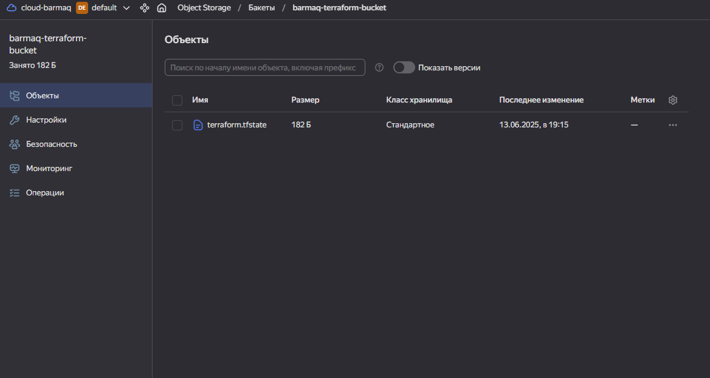

</details>

<details>
<summary><strong>🏗️ Создание основной инфраструктуры</strong></summary>

#### Автоматизация через CI/CD

Создание инфраструктуры осуществляется через **GitHub Actions**.

**Репозиторий Terraform:** [terraform-dapp](https://github.com/barmaq/terraform-dapp)

#### Компоненты инфраструктуры

**VPC с подсетями в разных зонах доступности:**
- [Основной манифест VPC](https://github.com/barmaq/terraform-dapp/blob/main/main.tf)

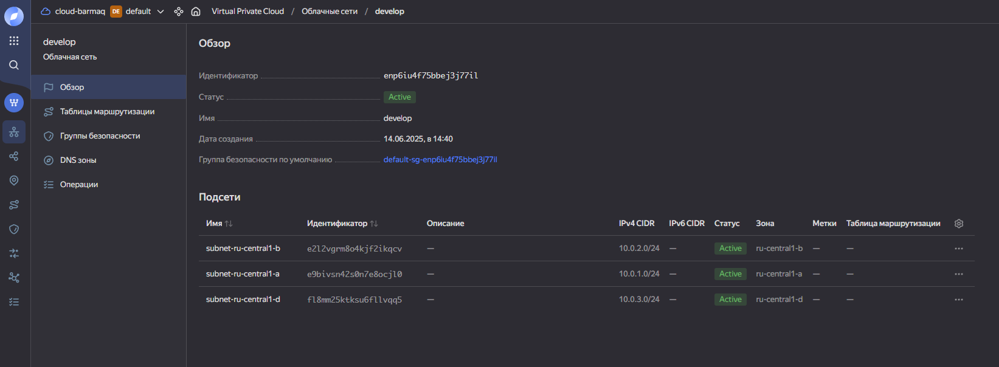

#### Результаты CI/CD

> **Примечание:** Поскольку все операции выполняются через Terraform, в логах отображаются результаты всех этапов.

**Логи выполнения:**
- [Полный лог workflow](./terraform_cicd_logs/)
- [Лог Terraform Apply](./terraform_cicd_logs/9_Terraform%20Apply.txt)

**Скриншоты процесса:**
- [Terraform CI/CD - 1](./images/terraform-cicd-01.png)
- [Terraform CI/CD - 2](./images/terraform-cicd-02.png)
- [Terraform CI/CD - 3](./images/terraform-cicd-03.png)

</details>

---

### 2. Создание Kubernetes кластера

<details>
<summary><strong>⚙️ Самостоятельная установка кластера</strong></summary>

> **Рекомендация:** Используем самостоятельную установку кластера вместо облачного ресурса для полного контроля.

#### Этапы создания кластера

**1. Подготовка инфраструктуры**

Создаем серверы для будущего кластера:

**Control Plane узлы:**
- [Манифест Control Plane](https://github.com/barmaq/terraform-dapp/blob/main/k8s-cp.tf)
- Количество определяется переменной `kube-k8s_cp_count` в variables.tf
- **Важно:** При увеличении ставить не меньше 3 узлов

**Worker узлы:**
- [Манифест Worker Nodes](https://github.com/barmaq/terraform-dapp/blob/main/k8s-nodes.tf)
- Количество определяется переменной `kube-k8s_nodes_count` в variables.tf

**Распределение по зонам:**
- Виртуальные машины создаются в трех зонах по очереди
- Первая → зона A, вторая → зона B, третья → зона D

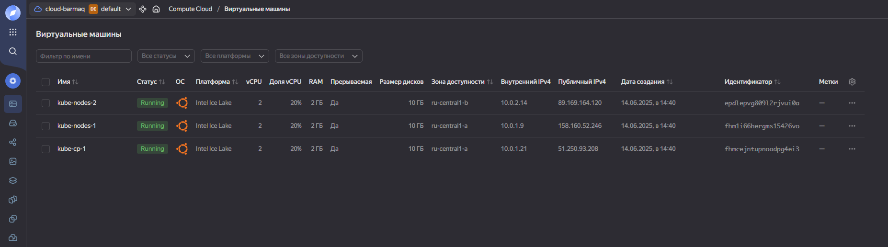

**2. Создание Ansible Inventory**

Формируем инвентарь на основе шаблона:

<details>
<summary>Код создания инвентаря</summary>

```hcl
resource "local_file" "inventory" {
  content = templatefile("${path.module}/templates/inventory.tpl", {
    control_plane_internal_ips = yandex_compute_instance.kube-cp[*].network_interface[0].ip_address
    worker_node_internal_ips = yandex_compute_instance.kube-nodes[*].network_interface[0].ip_address
  })
  filename = "${path.module}/inventory.yml"
}
```

</details>

**Шаблоны:**
- [Шаблон inventory](https://github.com/barmaq/terraform-dapp/blob/main/templates/inventory.tpl)

**3. Установка Ansible**

- Запуск с первой машины Control Plane (индекс [0])
- Копирование SSH ключей
- Установка в виртуальное окружение

**Манифест:** [k8s-cluster.tf](https://github.com/barmaq/terraform-dapp/blob/main/k8s-cluster.tf)

**4. Установка Kubernetes**

- Использование Kubespray для установки кластера
- **Время установки:** 10-20 минут
- Автоматическое удаление приватного ключа после установки
- Вывод kubeconfig в Terraform Outputs

**Просмотр kubeconfig:**
```bash
terraform output -raw kubeconfig
```

**5. Результат установки**

Кластер успешно установлен!

**Проверка:**
- Список подов и нод
- Автоматически созданный инвентарь


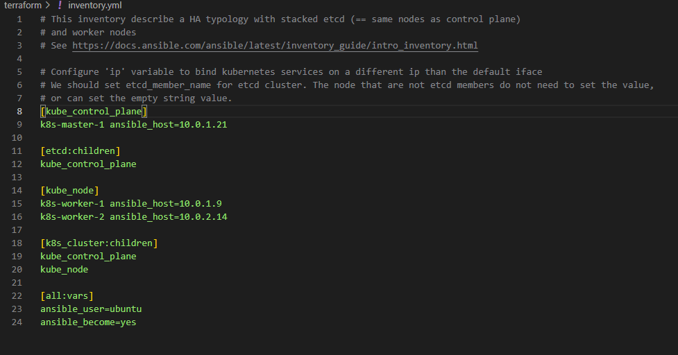

</details>

---

### 3. Создание тестового приложения

<details>
<summary><strong>📱 Разработка приложения</strong></summary>

#### Описание приложения

Создано простое веб-приложение с мини-игрой и nginx сервером.

**Репозиторий:** [barmaq-dapp](https://github.com/barmaq/barmaq-dapp)
**Dockerfile:** [Dockerfile](https://github.com/barmaq/barmaq-dapp/blob/11d15827731fcdbef74963609c1e0d77a6c72a77/Dockerfile)

#### Docker образ

Образ хранится в DockerHub:
- [Docker Image](https://hub.docker.com/repository/docker/barmaq/barmaq-dapp/general)

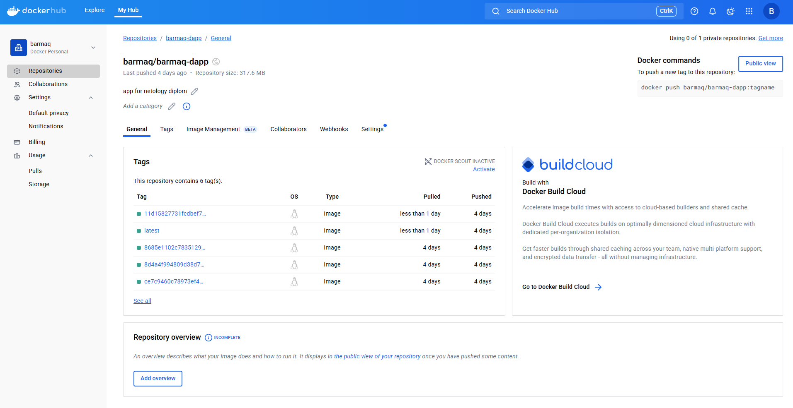

</details>

---

### 4. Подготовка системы мониторинга и деплой приложения

<details>
<summary><strong>📊 Мониторинг и деплой</strong></summary>

#### Развертывание в Kubernetes кластере

**1. Установка системы мониторинга**

- **Helm чарт:** kube-prometheus
- **Манифест:** [grafana.tf](https://github.com/barmaq/terraform-dapp/blob/main/graphana.tf)
- **Настройка:** Пароль Grafana через переменную `grafana_admin_password`

**2. Создание сервисов доступа**

- NodePort сервис для Grafana
- Вывод информации в Terraform Outputs

**3. Установка приложения**

Развертывание приложения в Kubernetes кластере:

**Шаблоны Kubernetes манифестов:**
- [Deployment](https://github.com/barmaq/terraform-dapp/blob/main/k8s-templates/deployment.yaml.tpl)
- [Service](https://github.com/barmaq/terraform-dapp/blob/main/k8s-templates/service.yaml.tpl)

**Манифест установки:** [app.tf](https://github.com/barmaq/terraform-dapp/blob/main/app.tf)

**4. Настройка сетевого доступа**

- DNS A запись
- Load Balancer для приложения

**Манифест:** [load-balancer.tf](https://github.com/barmaq/terraform-dapp/blob/main/load-balancer.tf)

#### Результаты развертывания

**Доступ к приложению:**
- **URL:** [app.barmaq.ru](https://app.barmaq.ru)

**Доступ к Grafana:**
- **URL:** [веб интерфейс Grafana](http://51.250.64.79:30000/)

<details>
<summary>Учетные данные для входа в Grafana</summary>

| Поле | Значение |
|------|----------|
| **Логин** | `admin` |
| **Пароль** | `ipt6CXqd0r` |

</details>

#### Дашборды мониторинга

**Доступные дашборды:**
- [Дашборд подов](./images/mon-pods.png)
- [Дашборд сети](./images/mon-nw.png)
- [Дашборд кластера](./images/mon-kubelet.png)
- [Дашборд неймспейсов](./images/mon-n.png)

</details>

---

### 5. Установка и настройка CI/CD

<details>
<summary><strong>🔄 Автоматизация процессов</strong></summary>

#### Настройка GitHub Actions

**Цель:** Автоматическая сборка Docker образа и деплой приложения при изменении кода.

#### Предварительная настройка

**Переменные окружения в GitHub:**
- Ключ от DockerHub
- kubeconfig для доступа к кластеру

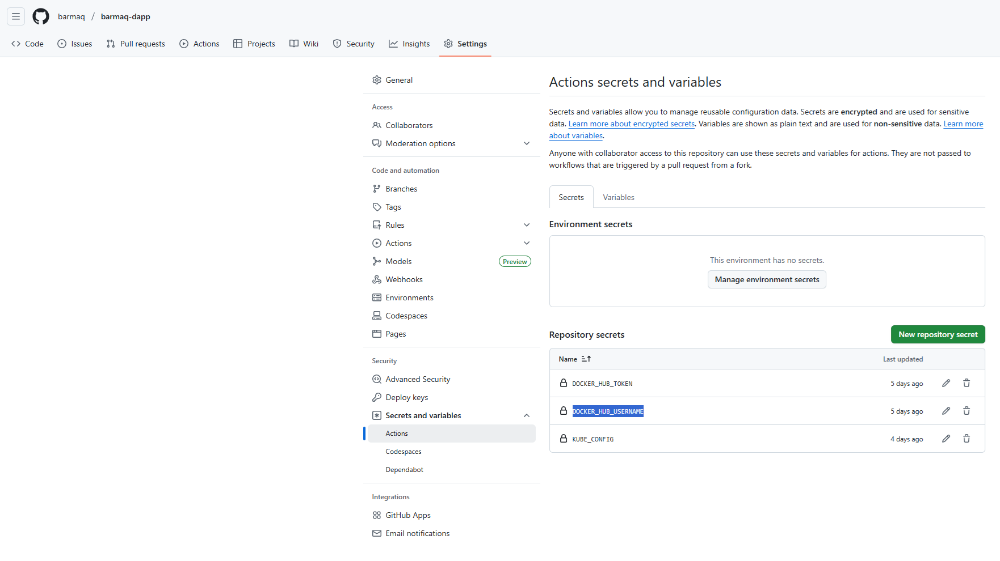

#### Workflow конфигурация

**Файл:** [ci_cd.yaml](https://github.com/barmaq/barmaq-dapp/blob/b577f3d28db46af2f4580c52cdc3d239915d57c7/.github/workflows/ci_cd.yaml)

**Этапы pipeline (при push в main):**
1. **Проверка линтерами и тестирование**
2. **Сборка образа и сохранение в DockerHub**
3. **Деплой приложения в Kubernetes**

#### Результаты работы CI/CD

**Версия приложения v0.0.13:**
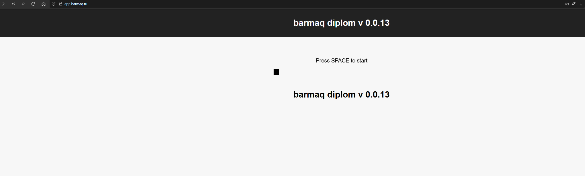

**Git commit:**
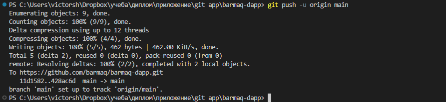

**Результат pipeline:**
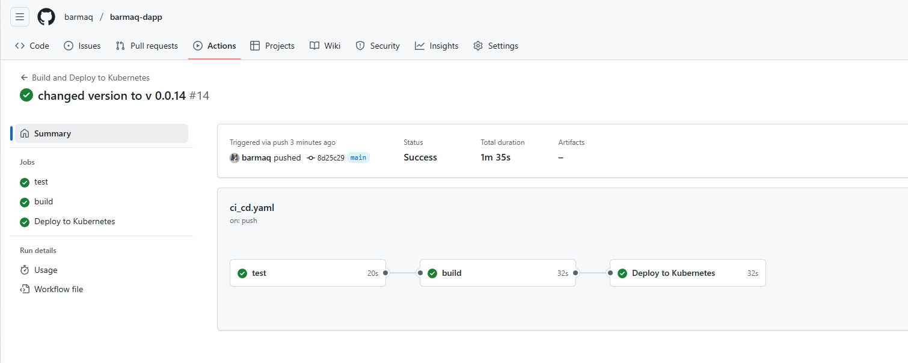

**Лог rollout обновления:**
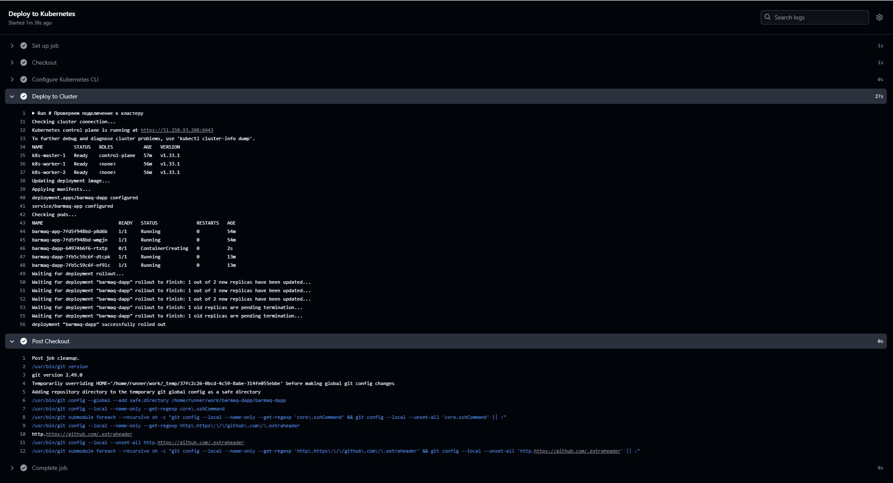

**Обновление до версии v0.0.14:**
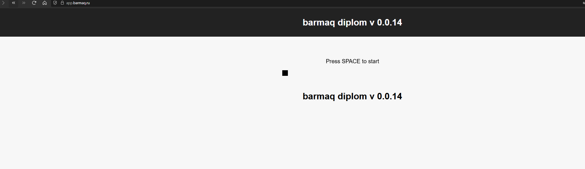

</details>

---

## 📋 Итоги проекта

### Автоматизация

Все ресурсы создаются автоматически после запуска Terraform. Ручное вмешательство минимально - только добавление `kubeconfig` в переменные GitHub репозитория.

**Безопасность:** Чувствительные данные вынесены в файл `secret.auto.tfvars` и добавлены в `.gitignore`.

### Компоненты проекта

| № | Компонент | Описание | Ссылка |
|---|-----------|----------|--------|
| **1** | Backend | Конфигурационные файлы Terraform. Инфраструктура DNS, сертификат | [backend](https://github.com/barmaq/terraform-dapp/tree/main/bucket) |
| **2** | Основная инфраструктура | Terraform манифесты. Инфраструктура, Kubernetes кластер, ALB балансер, развертка приложения | [terraform-dapp](https://github.com/barmaq/terraform-dapp) |
| **3** | Логи выполнения | Вывод terraform apply (большой файл из-за логов Kubespray) | [лог terraform apply](./terraform_cicd_logs/9_Terraform%20Apply.txt) |
| **4** | Приложение | Репозиторий с Dockerfile и Docker образ | [репозиторий](https://github.com/barmaq/barmaq-dapp) / [Docker image](https://hub.docker.com/repository/docker/barmaq/barmaq-dapp/general) |
| **5** | Доступ к сервисам | Тестовое приложение и веб интерфейс Grafana | [app.barmaq.ru](https://app.barmaq.ru) |

### Учетные данные Grafana

<details>
<summary>Данные для входа</summary>

| Поле | Значение |
|------|----------|
| **Логин** | `admin` |
| **Пароль** | `ipt6CXqd0r` |

</details>

### Результаты в Terraform

**Outputs:**
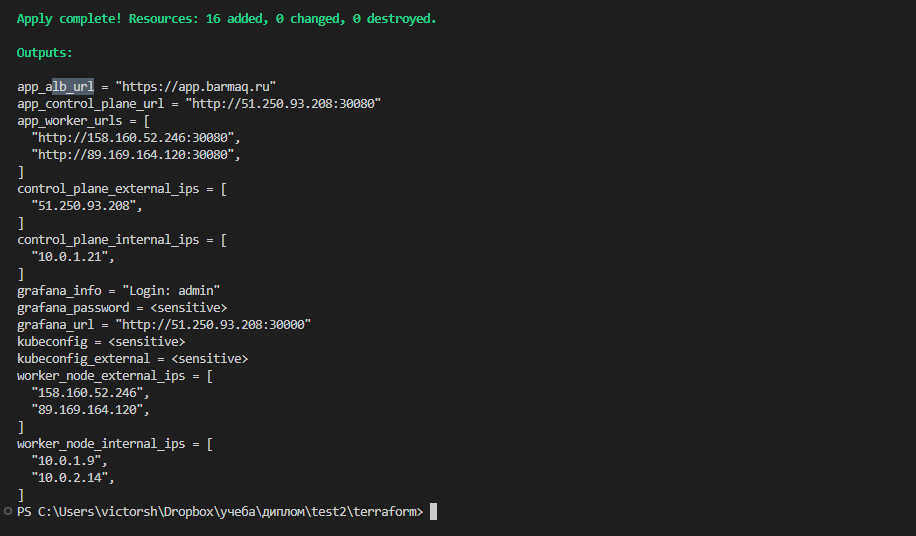

### Ресурсы в Yandex Cloud

**Обзор ресурсов:**
- [Общие ресурсы](./images/yc-all.png)
- [VPC](./images/yc-vpc.png)
- [Виртуальные машины](./images/yc-vm.png)
- [Load Balancer](./images/yc-alb.png)
- [DNS и сертификат](./images/dns-dns.png) / [Сертификат](./images/dns-cert.png)

---

## 👨‍💻 Автор

**Шумский Виктор / barmaq**

Проект создан для дипломной работы по автоматизации развертывания инфраструктуры.


