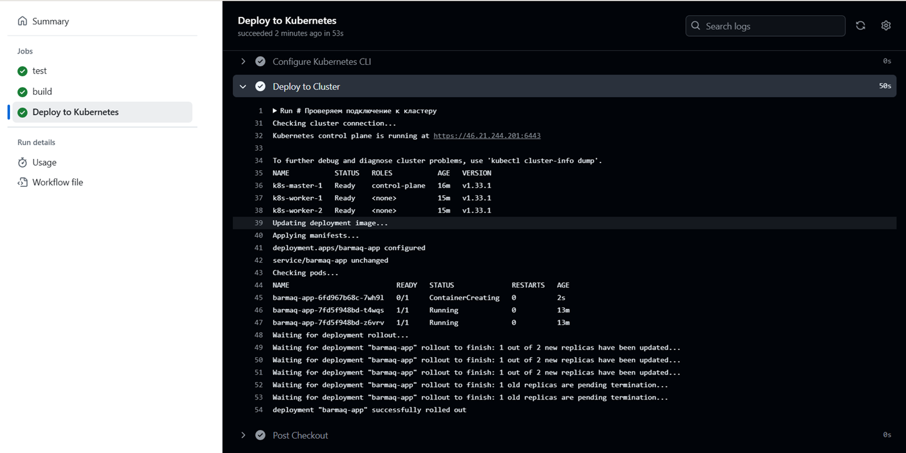

# Дипломный практикум в Yandex.Cloud
  * [Цели:](#цели)
  * [Этапы выполнения:](#этапы-выполнения)
     * [Создание облачной инфраструктуры](#создание-облачной-инфраструктуры)
     * [Создание **Kubernetes** кластера](#создание-kubernetes-кластера)
     * [Создание тестового приложения](#создание-тестового-приложения)
     * [Подготовка cистемы мониторинга и деплой приложения](#подготовка-cистемы-мониторинга-и-деплой-приложения)
     * [Установка и настройка CI/CD](#установка-и-настройка-cicd)

---
## Цели:

1. Подготовить облачную инфраструктуру на базе облачного провайдера Яндекс.Облако.
2. Запустить и сконфигурировать **Kubernetes** кластер.
3. Установить и настроить систему мониторинга.
4. Настроить и автоматизировать сборку тестового приложения с использованием Docker-контейнеров.
5. Настроить CI для автоматической сборки и тестирования.
6. Настроить CD для автоматического развёртывания приложения.

---
## Этапы выполнения:
<details>
<summary>Создание облачной инфраструктуры</summary>  

Подготовим Backend при помощи **Terraform**  
Отдельным блоком создаем S3 хранилище для хранения **Terraform** state и создаем dns зону и сертификат LE манифестом при помощи манифестов    
[манифест dns.tf](./bucket/dns.tf)   

[манифест хранилище для state s3.tf](./bucket/s3.tf)  
Получаем  `acces key` и `secret key` - через `output` и инициализируем основной проект  
```
terraform output -raw terraform_backend_secret_key  
terraform init --backend-config="access_key=******" --backend-config="secret_key==******""  
```
Проверяем что tfstate создался в S3  
    

Создание инраструктуры  

Создаем vpc с подсетями в разных зонах доступности  
[манифест vpc main.tf](./terraform/main.tf)  

  

</details>

---   

<details>
<summary>Создание **Kubernetes** кластера</summary>  

Рекомендованный вариант - самостоятельная установка кластера , а не использование облачного ресурса.  
При помощи **Terraform** и **Ansible** создадим кластер  

1. Подготавливаем инфраструктуру для установки **Kubernetes** кластера

   Создаем сервера для будущего кластера с помощью манифестов  
   Сервера для `Сontrol plane`  
   [control plane](./terraform/k8s-cp.tf)   
   Количество мастер нод определяется переменной `kube-k8s_cp_count` в **variables.tf**  
   
   По умолчанию стоит 1 , при увеличении ставить не меньше чем 3  


   Сервера для `Worker nodes`  
   [worker nodes](./terraform/k8s-nodes.tf)   
   Количество рабочих нод определяется переменной `kube-k8s_nodes_count` в **variables.tf**  

   Виртуальные машины в каждой группе создаются в трех зонах по очереди. т е первая в зону А , вторая в зону B , третья в зону D  

    


2. На основе созданных ВМ формируем из шаблона файл `inventory` для **Ansible**  
  
   формируем инвентарь на основе шаблона  
   <details>
   <summary>Код создания инвентаря</summary>  

      ```hcl  
      resource "local_file" "inventory" {  
      content = templatefile("${path.module}/templates/inventory.tpl", {  
         control_plane_internal_ips = yandex_compute_instance.kube-cp[*].network_interface[0].ip_address  
         worker_node_internal_ips = yandex_compute_instance.kube-nodes[*].network_interface[0].ip_address  
      })  
      filename = "${path.module}/inventory.yml"  
      }
      ```
   </details>

     
   [Шаблон inventory](./terraform/templates/inventory.tpl)  

   на выходе поулчаем файл инвентаря `inventory.yml`  


3. Устанавливаем **Ansible** при помощи **Terraform**  

   Запускать **Ansible** будем с первой созданной машине в группе `Control Plane` (в ресурсе с индексом [0])  
   При помощи **Terraform** скопируем ключи  
   Установим в виртуальное окружение **Ansible**  

   манифест **Terraform**  
   [k8s-cluster.tf](./terraform/k8s-cluster.tf) 


4. С помощью **Ansible** установим  **Kubernetes**  

   Используя `inventory.yml` установим **Kubernetes** кластер с помощью **Kubespray**  
   Установка довольно долгая, занимает 10-20 минут  
   По окончанию установки удалим свой привантный ключ  
   После создания кластера выведем информацию **kubeconfig** в **Outputs**  
   для просмотра **sensetive** вывода используем   
   ```
   terraform output -raw kubeconfig  
   ```


5. Кластер установлен !  

   список подов  и  список нод  
     

   пример автоматически созданного инвентаря  
    

</details>  

---  
<details>
<summary>Создание тестового приложения  </summary>  


1. Создадим простое приложение. Небольшой скрипт с миниигрой и nginx сервером  

   [Репозиторий приложения ](https://github.com/barmaq/barmaq-dapp)  
   [Dokerfile](https://github.com/barmaq/barmaq-dapp/blob/11d15827731fcdbef74963609c1e0d77a6c72a77/Dockerfile)  
   
2. Docker образ хранится в DockerHub  
   [образ Docker](https://hub.docker.com/repository/docker/barmaq/barmaq-dapp/general)  

     

</details>

---  
<details>
<summary>Подготовка cистемы мониторинга и деплой приложения  </summary>  


В созданном **Kubernetes** кластере разворачиваем мониторинг и наше приложение  

1. При помощи **Terraform** развернем **Helm**  чарт **kube-prometheus** для установки мониторинга  
   [мониторинг graphana.tf](./terraform/graphana.tf)  
   пароль от Grafana указываем свой при помощи перменной `grafana_admin_password`  

2. Создадим тем же манифестом **Terraform** сервис для доступа к **Graphana** и выведем информацию в `outputs`  

   доступ к веб интерфейсу **Graphana**  
   [веб интерфейс **Graphana**](http://46.21.244.201:30000/)   

3. Устанавливаем приложение  
   Развернем приложение на кластере **Kubernetes** с помощью **Terraform**   

   подготовим шаблоны манифестов **Kubernetes**  
   [deployment](./terraform/k8s-templates/deployment.yaml.tpl)  
   [service](./terraform/k8s-templates/service.yaml.tpl)  

   устанавливаем приложение
   [ манифест app.tf ](./terraform/app.tf)  

4. Создадим DNS А запись и Load Balancer 


   [манифест load-balancer.tf](./terraform/load-balancer.tf)  


5. Результат

доступ к приложению **barmaq-dapp**  
[app.barmaq.ru](https://app.barmaq.ru)  


 **результат**  

----------  

Доступ к **Graphana**  

[ссылка на Graphana]()  
<details>
<summary>Учетные данные для входа </summary>  
Логин

   ```   
   admin
   ``` 

Пароль

   ```  
   ipt6CXqd0r
   ```     
</details>

дашборд поды  
  

дашборд сеть  
  

дашборд кластер  
  

дашборд неймспейсы  
  

</details>

---  

<details>
<summary>Установка и настройка CI/CD</summary>  


Ннастройка **ci/cd** системы для автоматической сборки **docker image** и деплоя приложения при изменении кода.  

Используем **GitHub Actions**.  
Предварительно импортируем переменные в репозиторий с ключем от Dpckerhub и kubeconfig  
  

создадим **workflow**  
[workflow](https://github.com/barmaq/barmaq-dapp/blob/b577f3d28db46af2f4580c52cdc3d239915d57c7/.github/workflows/ci_cd.yaml)   

в **Pipline** запланированы этапы реагирующие на **push** в ветку **main**  
 1.  проверка линтерами и тестирование  
 2.  сборка образа и сохранение в **DockerHub**    
 3.  деплой приложения в **Kubernetes** на основе шаблонов   

приложение версии v 0.0.13     
  

git commit  
 

результат pipeline  
 

лог rollout обновления  
 

приложение версии v 0.0.14 - версия обновилась!   
  

</details>

---

<details>
<summary>Итоги</summary>  

Все ресурсы создаются автоматически после запуска **Terraform**. Вручную только добавляем `kubeconfig` в переменные репозитория **GitHub**  
Чувствительные данные вынесены в файл secret.auto.tfvars и добавлены в .gitignore  


1. Подготовка backend. Конфигурационные файлы **Terraform**. Инфраструктура DNS, сертификат  
[backend](./bucket/)  
1. Основной блок. Конфигурационные файлы **Terraform**.  Инфраструктура, **Kubernetes** кластер, ALB балансер, развертка приложения.   
[terraform](./terraform/)  
3. вывод `terraform apply` Файл большой изза большого количества логов `Kubespray`   
[лог terraform apply](./terraform/apply_output.txt)  
4. Репозиторий с `Dockerfile` тестового приложения и ссылка на собранный docker image.   
[репозиторий](https://github.com/barmaq/barmaq-dapp)   
[Dockerfile](https://github.com/barmaq/barmaq-dapp/blob/b577f3d28db46af2f4580c52cdc3d239915d57c7/Dockerfile)   
[docker image](https://hub.docker.com/repository/docker/barmaq/barmaq-dapp/general)   
6. Ссылка на тестовое приложение и веб интерфейс **Grafana** с данными доступа.  
[app.barmaq.ru](https://app.barmaq.ru)  
[веб интерфейс **Graphana**](http://46.21.244.201:30000/)  

<details>
<summary>Учетные данные для входа </summary>  
Логин

   ```   
   admin
   ``` 

Пароль

   ```  
   ipt6CXqd0r
   ```     
</details>


6. `Outputs` в   **Terraform**   
  
7. Ресурсы в  **Yandex Cloud**  
общие  
 
vpc   
 
ВМ   
 
load balancer  
 
dns и сертификат  
 
 

</details>


